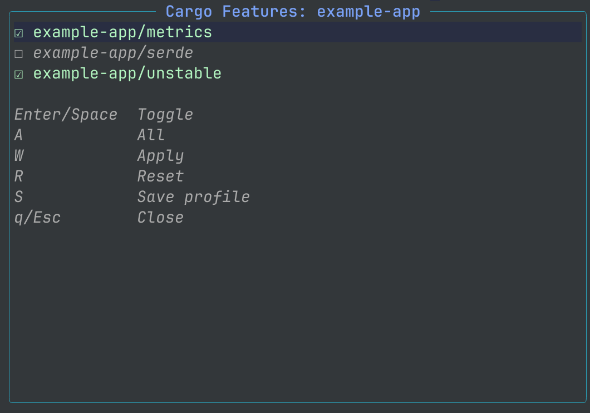

# cargo-features.nvim

Native Cargo feature switching for `rust-analyzer` in Neovim.

`cargo-features.nvim` opens a floating UI for the nearest `Cargo.toml`,
lets you toggle features, and applies the selection to active rust-analyzer
clients. It has no runtime dependencies.



## Requirements

- Neovim 0.11+
- An active `rust-analyzer` LSP client
- `cargo` for best feature discovery

## Why

Rust projects often put important code behind Cargo features. In Neovim, changing
the feature set usually means editing LSP settings, running a rustaceanvim
command, or keeping a local helper around.

This plugin gives that workflow an interactive UI:

```vim
:CargoFeatures
```

It talks to existing rust-analyzer clients, so it works with the LSP setup you
already use. The plugin recognizes the canonical `rust-analyzer` client name,
the `rust_analyzer` compatibility alias, and custom-named clients launched with
the `rust-analyzer` executable.

## Installation

### lazy.nvim

Tagged releases are recommended for normal users. `main` may contain breaking
or experimental pre-release changes.

```lua
{
  "ddtkey/cargo-features.nvim",
  version = "*",
  ft = "rust",
  cmd = {
    "CargoFeatures",
    "CargoFeaturesApplyProfile",
    "CargoFeaturesReset",
    "CargoFeaturesDebug",
  },
  keys = {
    {
      "<leader>rf",
      function()
        require("cargo-features").open()
      end,
      desc = "Cargo Features",
    },
  },
  opts = {},
}
```

To pin the first stable release exactly, use the same spec but replace
`version` with:

```lua
tag = "v0.1.0",
```

For development/latest, use the same spec but replace `version` with:

```lua
branch = "main",
```

## Usage

Open the picker:

```vim
:CargoFeatures
```

If the plugin cannot find the expected LSP client, run:

```vim
:CargoFeaturesDebug
```

Remove plugin-applied overrides and return to the rust-analyzer/Cargo defaults:

```vim
:CargoFeaturesReset
```

Apply a saved profile directly to rust-analyzer:

```vim
:CargoFeaturesApplyProfile debug
```

Open a picker for saved profiles in the current project:

```vim
:CargoFeaturesApplyProfile
```

The command searches both the current package profile store and the containing
workspace profile store when available. Picker entries are labeled as
`name (package)` or `name (workspace)`. With an explicit name, package profiles
win over workspace profiles when both exist.

`CargoFeaturesReset!` is available when you explicitly want to clear matching
live Cargo feature settings even if the plugin has no in-memory ownership record
for them.

Default keys:

| Key | Action |
| --- | --- |
| `<CR>` / `<Space>` | Toggle feature |
| `A` | Toggle all |
| `W` | Apply |
| `R` | Reset plugin-applied override |
| `S` | Save profile |
| `q` / `<Esc>` | Close |

Lua helpers:

```lua
require("cargo-features").reset(opts)
require("cargo-features").apply_profile("debug", opts)
```

`reset()` resolves the current buffer by default. Pass `force = true` to clear
matching live Cargo feature settings even without a remembered plugin-applied
override.
`apply_profile()` resolves the current buffer by default, loads a named profile,
and applies it to matching rust-analyzer clients.

Experimental profile helpers are public for pre-1.0 feedback:

```lua
require("cargo-features").save_profile("debug", opts)
require("cargo-features").load_profile("debug", opts)
require("cargo-features").delete_profile("debug", opts)
require("cargo-features").list_profiles(opts)
```

`save_profile()` requires `opts.manifest_path` and accepts `features`,
`default_enabled`, `scope`, `workspace_root`, and `package_name`.
`load_profile()`, `delete_profile()`, and `list_profiles()` require enough
context to find the profile key: package profiles use `manifest_path`;
workspace profiles use `workspace_root` when `scope = "workspace"`.
`:CargoFeaturesApplyProfile` is the supported explicit profile workflow; the
low-level profile helpers are still experimental pre-1.0 APIs.

## Configuration

Defaults:

```lua
require("cargo-features").setup({
  cargo = {
    use_metadata = true,
    metadata_timeout = 3000,
    metadata_extra_args = {},
    metadata_env = {},
    metadata_cwd = nil,
  },
  lsp = {
    reapply = true,
  },
  persistence = {
    default_profile = "default",
    save_on_apply = false,
    load_on_open = "never", -- "never" | "if_no_client" | "always"
    apply_on_attach = false,
  },
  ui = {
    ascii_icons = false,
    border = "rounded",
    height = 18,
    title = "Cargo Features",
    width = 60,
    icons = {
      checked = "☑",
      unchecked = "☐",
      ascii_checked = "[x]",
      ascii_unchecked = "[ ]",
    },
    keymaps = {
      toggle = { "<CR>", " " },
      toggle_all = "A",
      apply = "W",
      reset = "R",
      save_profile = "S",
      close = { "q", "<Esc>" },
    },
  },
})
```

## Behavior

- Feature discovery uses async `cargo metadata --no-deps` when available.
- If metadata fails, a small fallback parser reads simple local `[features]`
  keys.
- Applying features updates `rust-analyzer.cargo.features` and
  `rust-analyzer.cargo.noDefaultFeatures`, then sends
  `workspace/didChangeConfiguration`.
- Unchecking every feature applies an explicit empty feature set. Reset is
  different: it removes the plugin-applied override and lets rust-analyzer use
  Cargo.toml/default Cargo behavior again.
- After apply/reset, the plugin makes a private best-effort reattach of loaded
  Rust buffers attached to the updated rust-analyzer clients to refresh
  inactive-code highlighting. It does not reload files, delete buffers, open
  unloaded buffers, or restart rust-analyzer.
- `:CargoFeaturesReset` clears plugin-applied live overrides remembered in the
  current Neovim session and does not delete disk profiles. `:CargoFeaturesReset!`
  can clear matching live Cargo feature settings without an ownership record.
- `S` in the UI saves the current checkbox selection as a named profile without
  applying it to rust-analyzer or closing the UI. Pressing Enter at the prompt
  saves to `default_profile`, normally `"default"`. `W` applies to
  rust-analyzer; when `persistence.save_on_apply = true`, it also saves
  `default_profile` after a successful apply.
- With `lsp.reapply = true`, selections applied from the UI are remembered in
  memory and reapplied to matching rust-analyzer clients that attach later in
  the same Neovim session.
- With `persistence.apply_on_attach = true`, the default profile is applied to
  matching rust-analyzer clients when they attach, but only when the client has
  no explicit Cargo/check feature settings. This is opt-in and only uses
  `default_profile`.
- Live rust-analyzer settings are treated as the source of truth while a client
  is attached. Session-local reapply only runs when the new client has no
  explicit Cargo/check feature settings, so it does not overwrite user-authored
  rust-analyzer config.
- Reapply groups remembered selections by Cargo workspace. If one
  rust-analyzer client appears to cover multiple unrelated Cargo workspaces,
  automatic reapply is skipped instead of sending a mixed `cargo.features` list.
- Lua callers that use `require("cargo-features").apply()` should pass
  `remember = true` when they want the same session-local LspAttach reapply.
- When applying from a Rust buffer, an attached rust-analyzer client is used
  even if its root metadata is missing or unusual.
- `rust-analyzer.check.*` feature settings are treated conservatively. If the
  user already configured explicit check feature keys, the plugin keeps them in
  sync; otherwise it leaves check settings alone.
- Workspace member features are sent as `package/feature` when needed.
- Virtual workspace default features are not shown as normal checkboxes because
  `cargo.noDefaultFeatures` is workspace-global.
- If remembered default-feature states ever conflict inside one workspace,
  reapply keeps defaults enabled when any remembered entry enables them.
- Profile storage is available for explicit save/load actions. Profiles are
  stored under `stdpath("state")/cargo-features.nvim/profiles.json`.
- Automatic profile behavior is opt-in: `save_on_apply` saves the UI-applied
  selection to `default_profile`, and `load_on_open` controls whether opening
  the UI preselects from `default_profile`. `apply_on_attach` controls whether
  `default_profile` is applied to rust-analyzer on LspAttach. Automatic
  save/load/apply only uses `default_profile`.
- Profiles are user-local global storage keyed by absolute workspace/manifest
  paths. The plugin does not write project-local profile files.
- `S` saves the current UI selection as a named profile.
- `:CargoFeaturesApplyProfile <name>` explicitly loads and applies a named
  profile.
- `load_on_open = "never"` only disables automatic UI preselection; it does not
  control startup rust-analyzer application. Profiles can still be applied
  explicitly with `:CargoFeaturesApplyProfile <name>` or
  `require("cargo-features").apply_profile(name, opts)`.
- Profile auto-load is conservative by default. Live rust-analyzer settings are
  the source of truth; profiles override them on UI open only with
  `persistence.load_on_open = "always"`. Use `"if_no_client"` to load a profile
  only when no matching rust-analyzer client is available.

Some setups may still keep stale rust-analyzer inactive-code highlighting after
feature changes. Closing and reopening the affected buffer may be required. This
does not mean the feature config failed to apply.

Live apply can be checked locally with `just validate-ra`.

## Persistence Examples

Remember my last UI selection:

```lua
require("cargo-features").setup({
  persistence = {
    save_on_apply = true,
    load_on_open = "always",
  },
})
```

The UI opens with the saved profile even if rust-analyzer is active. Apply from
the UI to update rust-analyzer when needed.

Preselect saved profile only when rust-analyzer is not active:

```lua
require("cargo-features").setup({
  persistence = {
    save_on_apply = true,
    load_on_open = "if_no_client",
  },
})
```

Live rust-analyzer settings win when RA is active. This only affects UI
preselection; it does not apply the profile to rust-analyzer on attach.

Manual profiles only:

```lua
require("cargo-features").setup({
  persistence = {
    save_on_apply = false,
    load_on_open = "never",
  },
})
```

Use `:CargoFeaturesApplyProfile <name>` or
`require("cargo-features").apply_profile(name, opts)` to apply profiles
explicitly. Reset does not delete disk profiles.

Apply the default profile when rust-analyzer attaches:

```lua
require("cargo-features").setup({
  persistence = {
    apply_on_attach = true,
  },
})
```

This applies only `default_profile`, skips clients with explicit
rust-analyzer Cargo/check feature settings, and does not apply named profiles.

## Highlights

The UI uses semantic highlight groups linked to common Neovim groups:

| Group | Default link |
| --- | --- |
| `CargoFeaturesTitle` | `Title` |
| `CargoFeaturesEnabled` | `DiagnosticOk` |
| `CargoFeaturesDisabled` | `Comment` |
| `CargoFeaturesSelection` | `CursorLine` |
| `CargoFeaturesBorder` | `FloatBorder` |
| `CargoFeaturesHelp` | `Comment` |
| `CargoFeaturesError` | `DiagnosticError` |

Example:

```lua
vim.api.nvim_set_hl(0, "CargoFeaturesEnabled", { link = "String" })
```

## Manual Sandbox

For manual smoke testing, open
[examples/rust-workspace](examples/rust-workspace/README.md). It contains a
small artificial workspace with visible `#[cfg(feature = "...")]` branches and
an intentional `unstable` feature diagnostic.

## Development

Plenary unit tests run in CI. The plugin itself does not depend on Plenary at
runtime.

```sh
git clone --depth 1 https://github.com/nvim-lua/plenary.nvim .deps/plenary.nvim
just test
```

Optional checks:

```sh
just fmt-check
just validate-ra
```

`just validate-ra` starts a real `rust-analyzer` client against local fixtures.
It is manual validation, not part of the fast CI unit test suite, and prints
the rust-analyzer version it used.

## License

MIT
